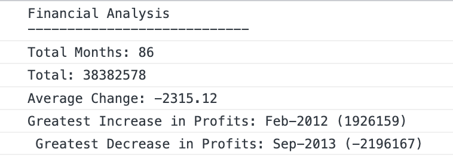

# Unit 4 Challenge: Console Finances

## Overview

A code for analyzing the financial records of a company. Output prints in the
browser's console.

## Table of Contents

- [Installation](#installation)
- [Usage](#usage)
- [Requirements](#requirements)
- [Credits](#credits)
- [License](#license)

## Installation

Follow these instructions to create your project and deploy it to GitHub Pages:

1. Create a new repository called `Console-Finances` on your GitHub account and
   clone it to your computer.

1. When you're ready to deploy, use the `git add`, `git commit`, and `git push`
   commands to save and push your code to your GitHub repository.

1. Navigate to your GitHub repository in the browser and then select the
   Settings tab on the right side of the page.

1. On the Settings page, scroll down to the GitHub Pages section. Then, in the
   section labeled Source, select the `main` branch as your source.

1. Navigate to <your-github-username.github.io/your-repository-name> and you
   will find that your new webpage has gone live! For example, if your GitHub
   username is "lernantino" and the project is "css-demo-site", then your URL
   would be <lernantino.github.io/css-demo-site>.

> **Important**: It might take a few minutes for GitHub pages to display your
> site correctly. If your project does not deploy or display correctly, check
> that all file paths in your application are relative and use the right casing.
> GitHub is case-sensitive, an inccorect capital or lowercase letter could cause
> problems in deployment.

Be sure to add, commit, and push your work to see the most up-to-date version of
your app!

## Usage

Output: https://eamrogowicz.github.io/console-finances/

GitHub source files: https://github.com/EAmrogowicz/console-finances.

The following image shows the console application's appearance and
functionality:

## Requirements

Use the financial dataset in the `ss/starter/index.js` file.

Write JavaScript code that analyzes the records to calculate each of the
following:

- The total number of months included in the dataset.

- The net total amount of Profit/Losses over the entire period.

- The average of the **changes** in Profit/Losses over the entire period.

  - You will need to track what the total change in profits are from month to
    month and then find the average.
  - (`Total/Number of months`)

- The greatest increase in profits (date and amount) over the entire period.

- The greatest decrease in losses (date and amount) over the entire period.

Your final code should print the analysis to the console.

## Credits

Reference for ReadMe specification:

- 2022 edX Boot Camps LLC.

## License

Please refer to the LICENCE in the repo.
